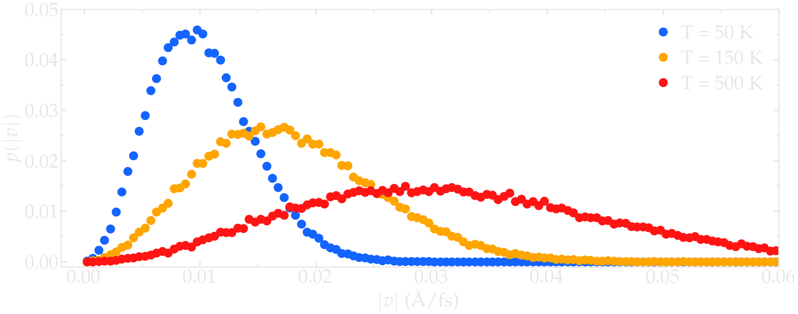

Initialize simulation
=====================

The *InitializeSimulation* class deals with creating the simulation box,
populating it with a chosen number of atoms with initial velocity. The
*InitializeSimulation* class also takes care of converting the inputs units 
into non-dimensionalized.

The *__init__* function
-----------------------

Open a new blank *.py* file, call it *main.py*, and copy the following
files in it: 

.. code-block:: python

    import numpy as np

    import warnings
    warnings.filterwarnings('ignore')

The *numpy* functions will be used here, and some annoying warning
are deactivated (will be useful when evaluating Metropolis criteria).
Then, copy:

.. code-block:: python

    class InitializeSimulation:
        def __init__(self,
                     number_atoms,
                     Lx,
                     dimensions=3,
                     Ly = None,
                     Lz = None,
                     epsilon=0.1,
                     sigma=1,
                     atom_mass=1,
                     seed=None,
                     desired_temperature=300,
                     desired_pressure=1)

        self.number_atoms = number_atoms
        self.Lx = Lx
        self.Ly = Ly
        self.Lz = Lz
        self.dimensions = dimensions
        self.epsilon = epsilon
        self.sigma = sigma
        self.atom_mass = atom_mass
        self.seed = seed
        self.desired_temperature = desired_temperature
        self.desired_pressure = desired_pressure

Important variables are being defined within the *__init__* function of the InitializeSimulation class. 
*number_atoms* is the desired initial number of atoms, *Lx* the box size along the *x* direction (or 
along all 3 directions if *Ly* and *Lz* are not provided, which is the default), *dimensions* is 
the number of dimensions of the system, *epsilon* the reference Lennard-Jones energy parameter in 
Kcal/mol, *sigma* the reference Lennard-Jones distance parameter in Angstrom, and *atom_mass* the 
reference mass in g/mol. The *desired_temperature* and *desired_pressure* parameters, respectively in
Kelvin and in atmosphere, are optional parameters that will be used in some case (as will be seen later
on), and *seed* offer the possibility to fix the seed of the randomly generated number, allowing for
repeating the same simulation if necessary -- this is usually useful during debugging. 

Add the following lines to the *__init__* function:

.. code-block:: python

        if self.seed is not None:
            np.random.seed(self.seed)

Initialize box
--------------

The *initialize_box* functions takes the inputs values for :math:`Lx` (and optionally 
:math:`Ly` and :math:`Lz`) to create a cuboid box of dimensions :math:`Lx \times Ly \times Lz`,
if :math:`Ly` and :math:`Lz` are provided, or :math:`Lx \times Lx \times Lx`, 
if :math:`Ly` and :math:`Lz` are not provided. For system with *dimensions* lower than 3,
2D or even 1D simulation boxes are created.

.. code-block:: python

    def initialize_box(self):
        """Define box boundaries based on Lx, Ly, and Lz.

        If Ly or Lz or both are None, then Lx is used instead"""
        box_boundaries = np.zeros((self.dimensions, 2))
        for dim, L in zip(range(self.dimensions), [self.Lx, self.Ly, self.Lz]):
            if L is not None:
                box_boundaries[dim] = -L/2, L/2
            else:
                box_boundaries[dim] = -self.Lx/2, self.Lx/2
        box_boundaries = self.nondimensionalise_units(box_boundaries, "distance")
        self.box_boundaries = box_boundaries

Note that choosing a dimension different fom 3 may cause problem in other parts of the code, to be fixed.

Populate box
------------

The *populate_box* function add a number corresponding to *number_atoms* of atoms in the 
box at random positions. 

.. code-block:: python

    def populate_box(self):
        """Place atoms at random positions within the box."""
        atoms_positions = np.zeros((self.number_atoms, self.dimensions))
        if self.provided_positions is not None:
            atoms_positions = self.provided_positions/self.reference_distance
        else:
            for dim in np.arange(self.dimensions):
                atoms_positions[:, dim] = np.random.random(self.number_atoms)*np.diff(self.box_boundaries[dim]) - np.diff(self.box_boundaries[dim])/2    
        self.atoms_positions = atoms_positions

More advanced version of the *populate_box* function could for instance ensure that no overlap exists 
between the atoms. For simplicity, we stick here with simple positioning of the atoms. Another more
advanced alternative is to place the atoms on given lattice, like simple cubic lattice, which is 
useful for studying solids. Another common option is to restrain the placement of the atoms within a
certain sub-region of the system.

Give initial velocity to the atoms
----------------------------------

Providing the atoms with an initial velocity is useful to reach the target temperature faster.

.. code-block:: python

    def give_velocity(self):
        """Give velocity to atoms so that the initial temperature is the desired one."""
        atoms_velocities = np.zeros((self.number_atoms, self.dimensions))
        if self.provided_velocities is not None:
            atoms_velocities = self.provided_velocities/self.reference_distance*self.reference_time
        else:
            for dim in np.arange(self.dimensions):  
                atoms_velocities[:, dim] = np.random.normal(size=self.number_atoms)
        self.atoms_velocities = atoms_velocities
        self.calculate_temperature()
        scale = np.sqrt(1+((self.desired_temperature/self.temperature)-1))
        self.atoms_velocities *= scale

Commonly, one can make sure that no overall translational nor rotational momentum is given
to the atoms. 

The scale :math:`\sqrt{[ 1+((T_0/T-1) ]}` is used to rescale the velocity of the 
atoms so that the temperature of the system goes from :math:`T`, the current temperature,
to :math:`T_0`, the desired temperature.

Nondimensionalize the units
---------------------------

Units are given by the user in the so-called *real* units as defined by LAMMPS,
and are converted into non-dimensional units before the simulation starts. This 
is done thanks to the following function *nondimensionalise_units*, and is
based on the references distance (:math:`\sigma`), energy (:math:`\epsilon`),
and mass (:math:`m`) as provided by default.

.. code-block:: python

    def nondimensionalise_units(self, variable, type):
        kB = cst.Boltzmann*cst.Avogadro/cst.calorie/cst.kilo # kCal/mol/K
        if variable is not None:
            if type == "distance":
                variable /= self.reference_distance
            elif type == "energy":
                variable /= self.reference_energy
            elif type == "mass":
                variable /= self.reference_mass
            elif type == "temperature":
                variable /= self.reference_energy/kB
            elif type == "time":
                variable /= self.reference_time
            elif type == "pressure":
                variable *= cst.atm*cst.angstrom**3*cst.Avogadro/cst.calorie/cst.kilo/self.reference_energy*self.reference_distance**3
            else:
                print("Unknown variable type", type)
        return variable

Probe temperature
-----------------

The rescaling of the velocity requires to be able to calculate temperature. This is 
done using the formula :math:`T = 2 E_\text{kin} / N_\text{dof}`. Create the *Utilities*
class, and two functions: *calculate_kinetic_energy* and *calculate_temperature*. The
kinetic energy is simply calculated as :math:`E_\text{kin} = \sum_i 1/2 m v_i^2`, where
:math:`v_i` is the velocity of atom :math:`i`.

.. code-block:: python

    class Utilities:
        def __init__(self,
                    *args,
                    **kwargs):
            super().__init__(*args, **kwargs)

        def calculate_kinetic_energy(self):
            self.Ekin = np.sum(self.atom_mass*np.sum(self.atoms_velocities**2, axis=1)/2)

        def calculate_temperature(self):
            """Follow the expression given in the LAMMPS documentation"""
            self.calculate_kinetic_energy()
            Ndof = self.dimensions*self.number_atoms-self.dimensions
            self.temperature = 2*self.Ekin/Ndof

Save atom coordinate to file
----------------------------

Since one would like to visualize the box that is being create, let us start to fill the 
*Outputs* class and crate our first function named *write_lammps_data*. *write_lammps_data*
creates data file in a format that is readable by LAMMPS, as well as Ovito visualization
software. 

.. code-block:: python

    class Outputs:
        def __init__(self,
                    *args,
                    **kwargs):
            super().__init__(*args, **kwargs)

        def write_lammps_data(self, filename="lammps.data"):
            """Write a LAMMPS data file containing atoms positions and velocities"""
            f = open(filename, "w")
            f.write('# LAMMPS data file \n\n')
            f.write(str(self.number_atoms)+' atoms\n')
            f.write('1 atom types\n')
            f.write('\n')
            for LminLmax, dim in zip(self.box_boundaries*self.reference_distance, ["x", "y", "z"]):
                f.write(str(LminLmax[0])+' '+str(LminLmax[1])+' '+dim+'lo ' + dim +  'hi\n')
            f.write('\n')
            f.write('Atoms\n')
            f.write('\n')
            cpt = 1
            for xyz in self.atoms_positions*self.reference_distance:
                f.write(str(cpt)+ ' 1 ' + str(xyz[0]) + ' ' + str(xyz[1]) + ' ' + str(xyz[2]) +'\n')
                cpt += 1
            f.write('\n')
            f.write('Velocities\n')
            f.write('\n')
            cpt = 1
            for vxyz in self.atoms_velocities*self.reference_distance/self.reference_time:
                f.write(str(cpt) + ' ' + str(vxyz[0]) + ' ' + str(vxyz[1]) + ' ' + str(vxyz[2]) +'\n')
                cpt += 1
            f.close()

Final code
----------

The currently written code is:

.. code-block:: python

    from scipy import constants as cst
    import numpy as np

    class InitializeSimulation:
        def __init__(self,
                    number_atoms,
                    Lx,
                    dimensions=3,
                    Ly = None,
                    Lz = None,
                    epsilon=0.1,
                    sigma=1,
                    atom_mass=1,
                    seed=None,
                    desired_temperature=300,
                    desired_pressure=1,
                    provided_positions=None,
                    provided_velocities=None,
                    *args,
                    **kwargs,
                    ):
            super().__init__(*args, **kwargs) 
            self.number_atoms = number_atoms
            self.Lx = Lx
            self.Ly = Ly
            self.Lz = Lz
            self.dimensions = dimensions
            self.epsilon = epsilon
            self.sigma = sigma
            self.atom_mass = atom_mass
            self.seed = seed
            self.desired_temperature = desired_temperature
            self.desired_pressure = desired_pressure
            self.provided_positions = provided_positions
            self.provided_velocities = provided_velocities

            if self.seed is not None:
                np.random.seed(self.seed)

            self.reference_distance = self.sigma
            self.reference_energy = self.epsilon
            self.reference_mass = self.atom_mass
            self.reference_time = np.sqrt((self.reference_mass/cst.kilo/cst.Avogadro)*(self.reference_distance*cst.angstrom)**2/(self.reference_energy*cst.calorie*cst.kilo/cst.Avogadro))/cst.femto

            self.Lx = self.nondimensionalise_units(self.Lx, "distance")
            self.Ly = self.nondimensionalise_units(self.Ly, "distance")
            self.Lz = self.nondimensionalise_units(self.Lz, "distance")
            self.epsilon = self.nondimensionalise_units(self.epsilon, "energy")
            self.sigma = self.nondimensionalise_units(self.sigma, "distance")
            self.atom_mass = self.nondimensionalise_units(self.atom_mass, "mass")
            self.desired_temperature = self.nondimensionalise_units(self.desired_temperature, "temperature")
            self.desired_pressure = self.nondimensionalise_units(self.desired_pressure, "pressure")

            self.initialize_box()
            self.populate_box()
            self.give_velocity()
            self.write_lammps_data(filename="initial.data")

        def nondimensionalise_units(self, variable, type):
            kB = cst.Boltzmann*cst.Avogadro/cst.calorie/cst.kilo # kCal/mol/K
            if variable is not None:
                if type == "distance":
                    variable /= self.reference_distance
                elif type == "energy":
                    variable /= self.reference_energy
                elif type == "mass":
                    variable /= self.reference_mass
                elif type == "temperature":
                    variable /= self.reference_energy/kB
                elif type == "time":
                    variable /= self.reference_time
                elif type == "pressure":
                    variable *= cst.atm*cst.angstrom**3*cst.Avogadro/cst.calorie/cst.kilo/self.reference_energy*self.reference_distance**3
                else:
                    print("Unknown variable type", type)
            return variable

        def initialize_box(self):
            """Define box boundaries based on Lx, Ly, and Lz.

            If Ly or Lz or both are None, then Lx is used instead"""
            box_boundaries = np.zeros((self.dimensions, 2))
            for dim, L in zip(range(self.dimensions), [self.Lx, self.Ly, self.Lz]):
                if L is not None:
                    box_boundaries[dim] = -L/2, L/2
                else:
                    box_boundaries[dim] = -self.Lx/2, self.Lx/2
            box_boundaries = self.nondimensionalise_units(box_boundaries, "distance")
            self.box_boundaries = box_boundaries

        def populate_box(self):
            """Place atoms at random positions within the box."""
            atoms_positions = np.zeros((self.number_atoms, self.dimensions))
            if self.provided_positions is not None:
                atoms_positions = self.provided_positions/self.reference_distance
            else:
                for dim in np.arange(self.dimensions):
                    atoms_positions[:, dim] = np.random.random(self.number_atoms)*np.diff(self.box_boundaries[dim]) - np.diff(self.box_boundaries[dim])/2    
            self.atoms_positions = atoms_positions

        def give_velocity(self):
            """Give velocity to atoms so that the initial temperature is the desired one."""
            atoms_velocities = np.zeros((self.number_atoms, self.dimensions))
            if self.provided_velocities is not None:
                atoms_velocities = self.provided_velocities/self.reference_distance*self.reference_time
            else:
                for dim in np.arange(self.dimensions):  
                    atoms_velocities[:, dim] = np.random.normal(size=self.number_atoms)
            self.atoms_velocities = atoms_velocities
            self.calculate_temperature()
            scale = np.sqrt(1+((self.desired_temperature/self.temperature)-1))
            self.atoms_velocities *= scale

    class Utilities:
        def __init__(self,
                    *args,
                    **kwargs):
            super().__init__(*args, **kwargs)

        def calculate_kinetic_energy(self):
            self.Ekin = np.sum(self.atom_mass*np.sum(self.atoms_velocities**2, axis=1)/2)

        def calculate_temperature(self):
            """Follow the expression given in the LAMMPS documentation"""
            self.calculate_kinetic_energy()
            Ndof = self.dimensions*self.number_atoms-self.dimensions
            self.temperature = 2*self.Ekin/Ndof

    class Outputs:
        def __init__(self,
                    *args,
                    **kwargs):
            super().__init__(*args, **kwargs)

        def write_lammps_data(self, filename="lammps.data"):
            """Write a LAMMPS data file containing atoms positions and velocities"""
            f = open(filename, "w")
            f.write('# LAMMPS data file \n\n')
            f.write(str(self.number_atoms)+' atoms\n')
            f.write('1 atom types\n')
            f.write('\n')
            for LminLmax, dim in zip(self.box_boundaries*self.reference_distance, ["x", "y", "z"]):
                f.write(str(LminLmax[0])+' '+str(LminLmax[1])+' '+dim+'lo ' + dim +  'hi\n')
            f.write('\n')
            f.write('Atoms\n')
            f.write('\n')
            cpt = 1
            for xyz in self.atoms_positions*self.reference_distance:
                f.write(str(cpt)+ ' 1 ' + str(xyz[0]) + ' ' + str(xyz[1]) + ' ' + str(xyz[2]) +'\n')
                cpt += 1
            f.write('\n')
            f.write('Velocities\n')
            f.write('\n')
            cpt = 1
            for vxyz in self.atoms_velocities*self.reference_distance/self.reference_time:
                f.write(str(cpt) + ' ' + str(vxyz[0]) + ' ' + str(vxyz[1]) + ' ' + str(vxyz[2]) +'\n')
                cpt += 1
            f.close()

Tests
-----

tofix : for the test to work, *Outputs* need to inerit from *InitializeSimulation*... does 
that make sense? Should I introduce already an empty MD class? Would be cleaner...

Let us test the *InitializeSimulation* to make sure it does what is expected of it.
Let us general a very large number of particle with a given temperature:

.. code-block:: python

    temperature=500 # Kelvin

    x = Outputs(number_atoms=50000,
                Lx=12,
                desired_temperature=temperature,
                seed=69817,
                )
    x.write_lammps_data()

    velocity = x.atoms_velocities*x.reference_distance/x.reference_time
    norm_velocity = np.sqrt(velocity.T[0]**2 + velocity.T[1]**2 + velocity.T[2]**2)

Let us calculate a histogram from the norm of the velocity:

.. code-block:: python

    proba, vel = np.histogram(norm_velocity, bins=200, range=(0, 0.1))
    vel = (vel[1:]+vel[:-1])/2
    proba = proba/np.sum(proba)

Finally let us plot the distribution for 3 different temperatures using 
matplotlib pyplot:

.. code-block:: python

    plt.plot(vel, proba, 'o', color=color, markersize=15, label=r'T = '+str(temperature)+' K')

.. figure:: ../_static/chapter1/velocity-distributions-light.png
    :alt: NVE energy as a function of time
    :class: only-light 