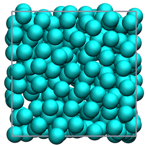

.. _chapter3-label:

Initialize the simulation
=========================

.. figure:: chapter3/avatar-dm.png
    :alt: Fluid made of argon atoms in a cubic box.
    :height: 200
    :align: right
    :class: only-dark

Here, the *InitializeSimulation* class is created. This class is used to
prepare the simulation box and populate the box randomly with atoms.
Let us improve the previously created *InitializeSimulation* class:

.. label:: start_InitializeSimulation_class

.. code-block:: python

    class InitializeSimulation(Prepare):
        def __init__(self,
                    box_dimensions,  # List - Angstroms
                    cut_off, # Angstroms
                    initial_positions=None,  # Array - Angstroms
                    neighbor=1, # Integer
                    *args,
                    **kwargs,
                    ):
            super().__init__(*args, **kwargs)
            self.box_dimensions = box_dimensions
            self.cut_off = cut_off
            self.neighbor = neighbor
            self.step = 0 # initialize simulation step
            self.initial_positions = initial_positions

.. label:: end_InitializeSimulation_class

Several parameters are provided to the *InitializeSimulation* class:

- The first parameter is the box dimensions, which is a list with a length
  corresponding to the dimension of the system. Each element of the list
  corresponds to a dimension of the box in Ångström in the x, y, and z
  directions, respectively.
- Optionally, a seed can be provided as an integer. If the seed is given
  by the user, the random number generator will always produce the same
  displacements.
- Optionally, initial positions for the atoms can be provided as an array
  of length corresponding to the number of atoms. If *initial_positions* 
  is left equal to *None*, positions will be randomly assigned to the
  atoms (see below).
- A cut off value with a default of 10 Ångströms is defined.
- The *neighbor* parameter determines the interval between recalculations of
  the neighbor lists. By default, a value of 1 is used, meaning that neighbor
  list will be reconstructed every steps. In certain cases, the number will be
  increased to recude the computation time.

..
    - Optionally, a thermo period and a dumping_period can be provided to  # TOFIX to be added later
    control the outputs from the simulation (it will be implemented  # TOFIX to be added later
    in :ref:`chapter5-label`).  # TOFIX to be added later

Finally, the *dimensions* of the system are calculated as the length of
*box_dimensions*.

Nondimensionalize units
-----------------------

Just like we did in :ref:`chapter2-label`, let us nondimensionalize the provided
parameters, here the *box_dimensions*, the *cut_off*, as well as the *initial_positions*:

.. label:: start_InitializeSimulation_class

.. code-block:: python

    def __init__(self,
        (...)
        self.initial_positions = initial_positions
        self.nondimensionalize_units(["box_dimensions", "cut_off",
                                      "initial_positions"])

.. label:: end_InitializeSimulation_class

Define the box
--------------

Let us define the simulation box using the values from *box_dimensions*. Add the following
method to the *InitializeSimulation* class:

.. label:: start_InitializeSimulation_class

.. code-block:: python

    def define_box(self):
        """Define the simulation box. Only 3D boxes are supported."""
        box_boundaries = np.zeros((3, 2))
        dim = 0
        for L in self.box_dimensions:
            box_boundaries[dim] = -L/2, L/2
            dim += 1
        self.box_boundaries = box_boundaries
        box_size = np.diff(self.box_boundaries).reshape(3)
        box_geometry = np.array([90, 90, 90])
        self.box_size = np.array(box_size.tolist()+box_geometry.tolist())

.. label:: end_InitializeSimulation_class

The *box_boundaries* are calculated from the *box_dimensions*. They
represent the lowest and highest coordinates in all directions. By symmetry,
the box is centered at 0 along all axes. A *box_size* is also defined,
following the MDAnalysis conventions: Lx, Ly, Lz, 90, 90, 90, where the
last three numbers are angles in degrees. Values different from *90* for
the angles would define a triclinic (non-orthogonal) box, which is not
currently supported by the existing code.

Let us call the *define_box* method from the *__init__* class:

.. label:: start_InitializeSimulation_class

.. code-block:: python

    def __init__(self,
        (...)
        self.nondimensionalize_units(["box_dimensions", "cut_off",
                                      "initial_positions"])
        self.define_box()

.. label:: end_InitializeSimulation_class

Populate the box
----------------

Here, the atoms are placed within the simulation box. If initial
positions were not provided (i.e., *initial_positions = None*), atoms
are placed randomly within the box. If *initial_positions* was provided
as an array, the provided positions are used instead. Note that, in this
case, the array must be of size 'number of atoms' times 'number of dimensions'.

.. label:: start_InitializeSimulation_class

.. code-block:: python

    def populate_box(self):
        if self.initial_positions is None:
            atoms_positions = np.zeros((np.sum(self.number_atoms), 3))
            for dim in np.arange(3):
                diff_box = np.diff(self.box_boundaries[dim])
                random_pos = np.random.random(np.sum(self.number_atoms))
                atoms_positions[:, dim] = random_pos*diff_box-diff_box/2
            self.atoms_positions = atoms_positions
        else:
            self.atoms_positions = self.initial_positions

.. label:: end_InitializeSimulation_class

In case *initial_positions is None*, and array is first created. Then, random
positions that are constrained within the box boundaries are defined using the
random function of NumPy. Note that, here, the newly added atoms are added
randomly within the box, without taking care of avoiding overlaps with
existing atoms. Overlaps will be dealt with using energy minimization,
see :ref:`chapter4-label`.

Let us call the *populate_box* method from the *__init__* class:

.. label:: start_InitializeSimulation_class

.. code-block:: python

    def __init__(self,
        (...)
        self.define_box()
        self.populate_box()

.. label:: end_InitializeSimulation_class

Build neighbor lists
--------------------

In molecular simulations, it is common practice to identify neighboring atoms
to save computational time. By focusing only on interactions between
neighboring atoms, the simulation becomes more efficient. Add the following
*update_neighbor_lists()* method to the *Utilities* class:

.. label:: start_Utilities_class

.. code-block:: python

    def update_neighbor_lists(self):
        if (self.step % self.neighbor == 0):
            print(self.cut_off)
            matrix = distances.contact_matrix(self.atoms_positions,
                cutoff=self.cut_off, #+2,
                returntype="numpy",
                box=self.box_size)
            neighbor_lists = []
            for cpt, array in enumerate(matrix[:-1]):
                list = np.where(array)[0].tolist()
                list = [ele for ele in list if ele > cpt]
                neighbor_lists.append(list)
            self.neighbor_lists = neighbor_lists

.. label:: end_Utilities_class

The *update_neighbor_lists()* method generates neighbor lists for each
atom, ensuring that only relevant interactions are considered in the
calculations. These lists will be recalculated at intervals specified by
the *neighbor* input parameter.

Update cross coefficients
-------------------------

At the same time as the neighbor lists are getting build up, let us also
pre-calculate the cross coefficients. This will make the force calculation
more practical (see below).

.. label:: start_Utilities_class

.. code-block:: python

    def update_cross_coefficients(self):
        if (self.step % self.neighbor == 0):
            # Precalculte LJ cross-coefficients
            sigma_ij_list = []
            epsilon_ij_list = []
            for Ni in np.arange(np.sum(self.number_atoms)-1): # tofix error for GCMC
                # Read information about atom i
                sigma_i = self.atoms_sigma[Ni]
                epsilon_i = self.atoms_epsilon[Ni]
                neighbor_of_i = self.neighbor_lists[Ni]
                # Read information about neighbors j
                sigma_j = self.atoms_sigma[neighbor_of_i]
                epsilon_j = self.atoms_epsilon[neighbor_of_i]
                # Calculare cross parameters
                sigma_ij_list.append((sigma_i+sigma_j)/2)
                epsilon_ij_list.append((epsilon_i+epsilon_j)/2)
            self.sigma_ij_list = sigma_ij_list
            self.epsilon_ij_list = epsilon_ij_list

.. label:: end_Utilities_class

Here, the values of the cross coefficients between atom of type 1 and 2,
:math:`\sigma_{12}` and :math:`\epsilon_{12}`, are assumed to follow the arithmetic mean:

.. math::

    \sigma_{12} = (\sigma_{11}+\sigma_{22})/2 \\
    \epsilon_{12} = (\epsilon_{11}+\epsilon_{22})/2

Finally, import the following library in the *Utilities.py* file:

.. label:: start_Utilities_class

.. code-block:: python

    import numpy as np
    from MDAnalysis.analysis import distances

.. label:: end_Utilities_class

Let us call the *update_neighbor_lists* and *update_cross_coefficients*
methods from the *__init__* class:

.. label:: start_InitializeSimulation_class

.. code-block:: python

    def __init__(self,
        (...)
        self.populate_box()
        self.update_neighbor_lists()
        self.update_cross_coefficients()

.. label:: end_InitializeSimulation_class
        
Test the code
-------------

Let us test the *InitializeSimulation* class to make sure that it does what
is expected, i.e. that it does create atoms that are located within the box
boundaries along all 3 dimensions of space:

.. label:: start_test_3a_class

.. code-block:: python

    import numpy as np
    from InitializeSimulation import InitializeSimulation
    from pint import UnitRegistry
    ureg = UnitRegistry()

    # Define atom number of each group
    nmb_1, nmb_2= [2, 3]
    # Define LJ parameters (sigma)
    sig_1, sig_2 = [3, 4]*ureg.angstrom
    # Define LJ parameters (epsilon)
    eps_1, eps_2 = [0.2, 0.4]*ureg.kcal/ureg.mol
    # Define atom mass
    mss_1, mss_2 = [10, 20]*ureg.gram/ureg.mol
    # Define box size
    L = 20*ureg.angstrom
    # Define a cut off
    rc = 2.5*sig_1

    # Initialize the prepare object
    init = InitializeSimulation(
        ureg = ureg,
        number_atoms=[nmb_1, nmb_2],
        epsilon=[eps_1, eps_2], # kcal/mol
        sigma=[sig_1, sig_2], # A
        atom_mass=[mss_1, mss_2], # g/mol
        box_dimensions=[L, L, L], # A
        cut_off=rc,
    )

    # Test function using pytest
    def test_placement():
        box_boundaries = init.box_boundaries
        atoms_positions = init.atoms_positions
        for atom_position in atoms_positions:
            for x, boundary in zip(atom_position, box_boundaries):
                assert (x >= boundary[0]) and (x <= boundary[1]), \
                f"Test failed: Atoms outside of the box at position {atom_position}"
        print("Test passed")

    # If the script is run directly, execute the tests
    if __name__ == "__main__":
        import pytest
        # Run pytest programmatically
        pytest.main(["-s", __file__])

.. label:: end_test_3a_class
