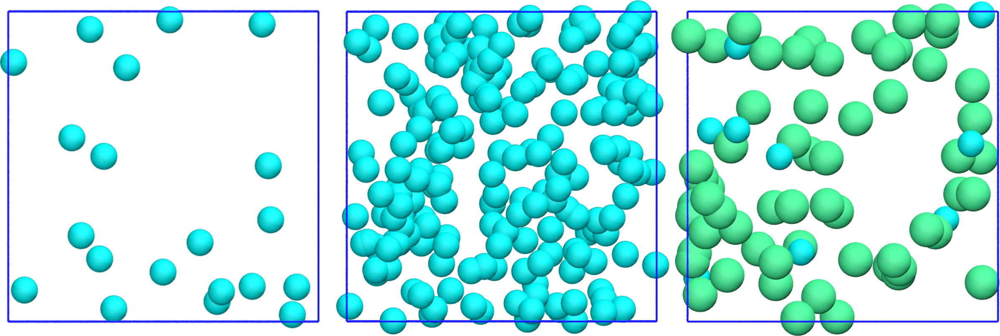

Print a data file
=================

.. container:: justify

    The positions of the atoms and the box size are printed
    to a LAMMPS data file.

Call the write_lammps_data method
---------------------------------

.. container:: justify

    Modify the *__init__* method from the *InitializeSimulation* class 
    to add the *write_lammps_data* method, which will be defined below.

.. code-block:: python

    def __init__(self,
                 number_atoms,
                 Lx,
                 epsilon=[0.1],
                 sigma=[1],
                 atom_mass=[1],
                 Ly=None,
                 Lz=None,
                 *args,
                 **kwargs):
        super().__init__(*args, **kwargs) 

        self.number_atoms = number_atoms
        self.Lx = Lx
        self.Ly = Ly
        self.Lz = Lz
        self.dimensions = 3
        self.epsilon = epsilon
        self.sigma = sigma
        self.atom_mass = atom_mass

        self.calculate_LJunits_prefactors()
        self.nondimensionalize_units()
        self.define_box()
        self.identify_atom_properties()
        self.populate_box()
        self.write_lammps_data(filename="initial.data")

Write the LAMMPS data file
--------------------------

.. container:: justify

    Add the following method to the *Outputs* class.

.. code-block:: python

    def write_lammps_data(self, filename="lammps.data"):
        f = open(filename, "w")
        f.write('# LAMMPS data file \n\n')
        f.write("%d %s"%(self.total_number_atoms, 'atoms\n')) 
        f.write("%d %s"%(np.max(self.atoms_type), 'atom types\n')) 
        f.write('\n')
        for LminLmax, dim in zip(self.box_boundaries*self.reference_distance, ["x", "y", "z"]):
            f.write("%.3f %.3f %s %s"%(LminLmax[0],LminLmax[1], dim+'lo', dim+'hi\n')) 
        f.write('\n')
        f.write('Atoms\n')
        f.write('\n')
        cpt = 1
        for type, xyz in zip(self.atoms_type,
                             self.atoms_positions*self.reference_distance):
            q = 0
            f.write("%d %d %d %.3f %.3f %.3f %.3f %s"%(cpt, 1, type, q, xyz[0], xyz[1], xyz[2], '\n')) 
            cpt += 1

Test the code
-------------

.. container:: justify

    We can take advantage of the current code and print the
    positions of the atoms in data files. 

.. code-block:: python

    import os
    from MolecularDynamics import MolecularDynamics

    md = MolecularDynamics(number_atoms=[10, 60],
                        Lx=30,
                        sigma=[3, 6],
                        epsilon=[0.1, 0.1],
                        atom_mass=[1, 1],
                        data_folder = "md-output/")
    md.run()

.. container:: justify

    The following figure shows systems with different numbers of atoms.
    |VMD| was used for generating the snapshot, you can find a |VMD_tutorial|
    here.

.. |VMD| raw:: html

    <a href="https://www.ks.uiuc.edu/Research/vmd" target="_blank">VMD</a>

.. |VMD_tutorial| raw:: html

    <a href="https://lammpstutorials.github.io/sphinx/build/html/tutorials/vmd/vmd-tutorial.html" target="_blank">VMD tutorial</a>

..  container:: figurelegend

    Figure: Systems generated with 3 different particle numbers. In all 3 cases,
    the box is a cube of volume :math:`(3~\text{nm})^3`.
    Left: 20 atoms of type 1.
    Middle: 200 atoms of type 1.
    Right: 10 atoms of type 1, and 60 atoms of type 2.