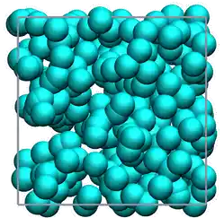

.. _chapter4-label:

Minimize the energy
===================

.. figure:: chapter4/avatar-dm.webp
    :alt: The fluid made of argon atoms during energy minimization with Python.
    :height: 200
    :align: right
    :class: only-dark

Now that the code for placing the atoms within the box has been written,
let us proceed to write the code for performing energy minimization of the
system. This step helps ensure that there is no unreasonable overlapping
between the atoms.

The steepest descent method is used for energy minimization, following these steps:

- 1) Start with an initial configuration and measure the initial potential energy,
     :math:`E_\text{pot}^\text{initial}`.
- 2) Calculate the gradient of the potential energy with respect to atomic positions
     to determine the direction of the steepest ascent in energy. The magnitude
     of this gradient is used to compute the maximum force acting on the atoms.
     This maximum force indicates the direction in which the energy decreases most
     rapidly.
- 3) Move the atoms in the opposite direction of the maximum
     force to minimize the potential energy by a displacement step.
     The size of the step is adjusted iteratively based on the reduction in energy.
- 4) Compute the new potential energy after the displacement, :math:`E_\text{pot}^\text{trial}`.
- 5) Evaluate the change in energy: :math:`\Delta E = E_\text{pot}^\text{trial} - E_\text{pot}^\text{initial}`.
  
  - If :math:`\Delta E < 0`, the new configuration is accepted as it results in
    lower energy, and the step size is increased.
  - If :math:`\Delta E \geq 0`, the new configuration is rejected, and the step
    size is decreased.

The process is repeated until the maximum number of steps is reached.
The goal is to iteratively reduce the potential energy and reach a stable,
minimized energy state.

Prepare the minimization
------------------------

Let us fill the *__init__()* method:

.. label:: start_MinimizeEnergy_class

.. code-block:: python

    class MinimizeEnergy(Measurements):
        def __init__(self,
                    maximum_steps,
                    *args,
                    **kwargs):
            self.maximum_steps = maximum_steps
            super().__init__(*args, **kwargs)
            
.. label:: end_MinimizeEnergy_class

An important parameter is *maximum_steps*, which sets the maximum number
of steps for the energy minimization process. The *displacement*
parameter, with a default value of 0.01 Ångström, sets the initial atom
displacement value.

The *thermo_outputs* and *data_folder* parameters are used for printing data
to files. These two parameters will be useful in the next chapter, :ref:`chapter5-label`.

Energy minimizer
----------------

Let us implement the energy minimized described at the top of this page. Add the
following *run()* method to the *MinimizeEnergy* class:

.. label:: start_MinimizeEnergy_class

.. code-block:: python

    def run(self):
        self.displacement = 0.01 # pick a random initial displacement (dimentionless)
        # *step* loops for 0 to *maximum_steps*+1
        for self.step in range(0, self.maximum_steps+1):
            # First, meevaluate the initial energy and max force
            self.update_neighbor_lists() # Rebuild neighbor list, if necessary
            self.update_cross_coefficients() # Recalculate the cross coefficients, if necessary
            # Compute Epot/MaxF/force
            init_Epot = self.compute_potential()
            forces, init_MaxF = self.compute_force()
            # Save the current atom positions
            init_positions = copy.deepcopy(self.atoms_positions)
            # Move the atoms in the opposite direction of the maximum force
            self.atoms_positions = self.atoms_positions \
                + forces/init_MaxF*self.displacement
            # Recalculate the energy
            trial_Epot = self.compute_potential()
            # Keep the more favorable energy
            if trial_Epot < init_Epot: # accept new position
                self.Epot = trial_Epot
                # calculate the new max force and save it
                forces, init_MaxF = self.compute_force()
                self.MaxF = np.max(np.abs(forces))
                self.wrap_in_box()  # Wrap atoms in the box, if necessary
                self.displacement *= 1.2 # Multiply the displacement by a factor 1.2
            else: # reject new position
                self.Epot = init_Epot # Revert to old energy
                self.atoms_positions = init_positions # Revert to old positions
                self.displacement *= 0.2 # Multiply the displacement by a factor 0.2

.. label:: end_MinimizeEnergy_class

The displacement, which has an initial value of 0.01, is adjusted through energy
minimization. When the trial is successful, its value is multiplied by 1.2. When
the trial is rejected, its value is multiplied by 0.2.

Compute_potential
-----------------

Computing the potential energy of the system is central to the energy minimizer,
as the value of the potential is used to decide if the trial is accepted or
rejected. Add the following method called *compute_potential()*  to the *Utilities*
class:

.. label:: start_Utilities_class

.. code-block:: python

    def compute_potential(self):
        """Compute the potential energy by summing up all pair contributions."""
        energy_potential = 0
        for Ni in np.arange(np.sum(self.number_atoms)-1):
            # Read neighbor list
            neighbor_of_i = self.neighbor_lists[Ni]
            # Measure distance
            rij = self.compute_distance(self.atoms_positions[Ni],
                                        self.atoms_positions[neighbor_of_i],
                                        self.box_size[:3])
            # Measure potential using information about cross coefficients
            sigma_ij = self.sigma_ij_list[Ni]
            epsilon_ij = self.epsilon_ij_list[Ni]
            energy_potential += np.sum(potentials(epsilon_ij, sigma_ij, rij))
        return energy_potential
    
.. label:: end_Utilities_class

Measuring the distance is an important step of computing the potential. Let us
do it using a dedicated method. Add the following method to the *Utilities*
class as well:

.. label:: start_Utilities_class

.. code-block:: python

    def compute_distance(self,position_i, positions_j, box_size, only_norm = True):
        """
        Measure the distances between two particles.
        The nan_to_num is crutial in 2D to avoid nan value along third dimension.
        # TOFIX: Move as function instead of a method?
        """
        rij_xyz = np.nan_to_num(np.remainder(position_i - positions_j
                                + box_size[:3]/2.0, box_size) - box_size[:3]/2.0)
        if only_norm:
            return np.linalg.norm(rij_xyz, axis=1)
        else:
            return np.linalg.norm(rij_xyz, axis=1), rij_xyz

.. label:: end_Utilities_class

Finally, the energy minimization requires the computation of the minimum
force in the system. Although not very different from the potential measurement,
let us create a new method that is dedicated solely to measuring forces:

.. label:: start_Utilities_class

.. code-block:: python

    def compute_force(self, return_vector = True):
        if return_vector: # return a N-size vector
            force_vector = np.zeros((np.sum(self.number_atoms),3))
        else: # return a N x N matrix
            force_matrix = np.zeros((np.sum(self.number_atoms),
                                    np.sum(self.number_atoms),3))
        for Ni in np.arange(np.sum(self.number_atoms)-1):
            # Read neighbor list
            neighbor_of_i = self.neighbor_lists[Ni]
            # Measure distance
            rij, rij_xyz = self.compute_distance(self.atoms_positions[Ni],
                                        self.atoms_positions[neighbor_of_i],
                                        self.box_size[:3], only_norm = False)
            # Measure force using information about cross coefficients
            sigma_ij = self.sigma_ij_list[Ni]
            epsilon_ij = self.epsilon_ij_list[Ni]       
            fij_xyz = potentials(epsilon_ij, sigma_ij, rij, derivative = True)
            if return_vector:
                # Add the contribution to both Ni and its neighbors
                force_vector[Ni] += np.sum((fij_xyz*rij_xyz.T/rij).T, axis=0)
                force_vector[neighbor_of_i] -= (fij_xyz*rij_xyz.T/rij).T 
            else:
                # Add the contribution to the matrix
                force_matrix[Ni][neighbor_of_i] += (fij_xyz*rij_xyz.T/rij).T
        if return_vector:
            max_force = np.max(np.abs(force_vector))
            return force_vector, max_force
        else:
            return force_matrix
    
.. label:: end_Utilities_class

Here, two types of outputs can
be requested by the user: *force-vector*, and *force-matrix*. 
The *force-matrix* option will be useful for pressure calculation, see
:ref:`chapter7-label`.

Wrap in box
-----------

Every time atoms are being displaced, one has to ensure that they remain in
the box. This is done by the *wrap_in_box()* method that must be placed
within the *Utilities* class:

.. label:: start_Utilities_class

.. code-block:: python

    def wrap_in_box(self):
        for dim in np.arange(3):
            out_ids = self.atoms_positions[:, dim] \
                > self.box_boundaries[dim][1]
            self.atoms_positions[:, dim][out_ids] \
                -= np.diff(self.box_boundaries[dim])[0]
            out_ids = self.atoms_positions[:, dim] \
                < self.box_boundaries[dim][0]
            self.atoms_positions[:, dim][out_ids] \
                += np.diff(self.box_boundaries[dim])[0]

.. label:: end_Utilities_class

Test the code
-------------

Let us test the *MinimizeEnergy* class to make sure that it does what
is expected, i.e. that it leads to a potential energy that is small, and
typically negative.

.. label:: start_test_4a_class

.. code-block:: python

    from MinimizeEnergy import MinimizeEnergy
    from pint import UnitRegistry
    ureg = UnitRegistry()

    # Define atom number of each group
    nmb_1, nmb_2= [2, 3]
    # Define LJ parameters (sigma)
    sig_1, sig_2 = [3, 4]*ureg.angstrom
    # Define LJ parameters (epsilon)
    eps_1, eps_2 = [0.2, 0.4]*ureg.kcal/ureg.mol
    # Define atom mass
    mss_1, mss_2 = [10, 20]*ureg.gram/ureg.mol
    # Define box size
    L = 20*ureg.angstrom
    # Define a cut off
    rc = 2.5*sig_1

    # Initialize the prepare object
    minimizer = MinimizeEnergy(
        ureg = ureg,
        maximum_steps=100,
        number_atoms=[nmb_1, nmb_2],
        epsilon=[eps_1, eps_2], # kcal/mol
        sigma=[sig_1, sig_2], # A
        atom_mass=[mss_1, mss_2], # g/mol
        box_dimensions=[L, L, L], # A
        cut_off=rc,
    )
    minimizer.run()

    # Test function using pytest
    def test_energy_and_force():
        Final_Epot = minimizer.Epot
        Final_MaxF = minimizer.MaxF
        assert Final_Epot < 0, f"Test failed: Final energy too large: {Final_Epot}"
        assert Final_MaxF < 10, f"Test failed: Final max force too large: {Final_MaxF}"
        print("Test passed")

    # If the script is run directly, execute the tests
    if __name__ == "__main__":
        import pytest
        # Run pytest programmatically
        pytest.main(["-s", __file__])

.. label:: end_test_4a_class

For such as low density in particle, we can reasonably expect the energy to be always
negative after 100 steps.