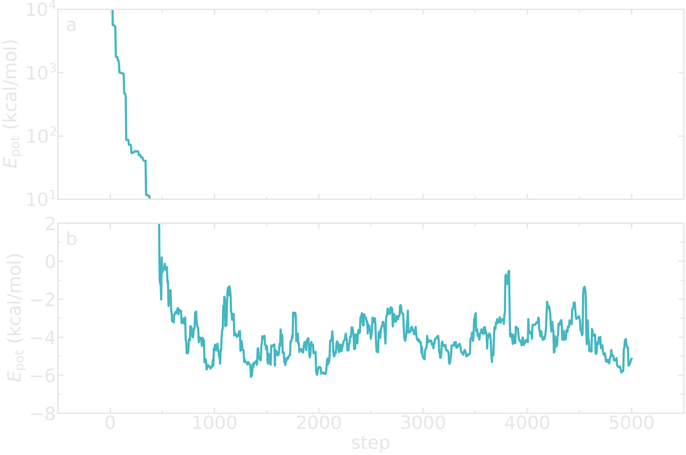

Monte carlo displacement
========================

.. container:: justify

    A Monte Carlo algorithm is implemented and the 
    evolution of the system is followed with time.

Add desired temperature
-----------------------

.. container:: justify

    In the *InitializeSimulation* class, add a parameter
    called *desired_temperature*.

.. code-block:: python

    class InitializeSimulation:
        def __init__(self,
                    number_atoms,
                    Lx,
                    epsilon=[0.1],
                    sigma=[1],
                    atom_mass=[1],
                    desired_temperature=300,
                    Ly=None,
                    Lz=None,
                    *args,
                    **kwargs):
            super().__init__(*args, **kwargs) 

            self.number_atoms = number_atoms
            self.Lx = Lx
            self.Ly = Ly
            self.Lz = Lz
            self.dimensions = 3
            self.epsilon = epsilon
            self.sigma = sigma
            self.atom_mass = atom_mass
            self.desired_temperature = desired_temperature

            self.calculate_LJunits_prefactors()
            self.nondimensionalize_units()
            self.define_box()
            self.identify_atom_properties()
            self.populate_box()
            self.write_lammps_data(filename="initial.data")

.. container:: justify

    The following must be added to the method named *calculate_LJunits_prefactors*.

.. code-block:: python

    kB = cst.Boltzmann*cst.Avogadro/cst.calorie/cst.kilo # kCal/mol/K
    self.reference_temperature = self.epsilon[0]/kB # K

.. container:: justify

    The following must be added to the method named *nondimensionalize_units*.

.. code-block:: python

    self.desired_temperature /= self.reference_temperature

Create new parameters
---------------------

.. container:: justify

    Add 2 new parameters called *maximum_steps* and *displace_mc*
    to the *__init__* method of the *MonteCarlo* class.
    Let us also normalized the displace_mc.

.. code-block:: python

    def __init__(self,
                 maximum_steps,
                 displace_mc=None,
                 *args,
                 **kwargs,
                 ):
                 super().__init__(*args, **kwargs)

                 self.maximum_steps = maximum_steps
                 self.displace_mc = displace_mc

        if self.displace_mc is not None:
            self.displace_mc /= self.reference_distance

Monte Carlo displacement
------------------------

.. container:: justify

    Within the *MonteCarlo* class, create a new loop that
    runs over a number of steps corresponding to maximum_steps + 1.

.. code-block:: python

    def run(self):
        for self.step in range(0, self.maximum_steps+1):
            self.monte_carlo_displacement()
            self.wrap_in_box()
            self.update_dump(filename="dump.mc.lammpstrj", velocity=False)

.. container:: justify

    Add also the *monte_carlo_displacement* method to the *MonteCarlo* class.

.. code-block:: python

    def monte_carlo_displacement(self):
        if self.displace_mc is not None:
            beta =  1/self.desired_temperature
            Epot = self.calculate_potential_energy(self.atoms_positions)
            trial_atoms_positions = copy.deepcopy(self.atoms_positions)
            atom_id = np.random.randint(self.total_number_atoms)
            trial_atoms_positions[atom_id] += (np.random.random(3)-0.5)*self.displace_mc
            trial_Epot = self.calculate_potential_energy(trial_atoms_positions)
            acceptation_probability = np.min([1, np.exp(-beta*(trial_Epot-Epot))])
            if np.random.random() <= acceptation_probability:
                self.atoms_positions = trial_atoms_positions
                self.Epot = trial_Epot
            else:
                self.Epot = Epot 

Wrap in the box
---------------

.. container:: justify

    One has to make sure that the atoms remain within the 
    box by wrapping the positions of the atoms. Within the
    *Utilities* method, add the following *method*.

.. code-block:: python

    def wrap_in_box(self):
        for dim in np.arange(self.dimensions):
            out_ids = self.atoms_positions[:, dim] > self.box_boundaries[dim][1]
            self.atoms_positions[:, dim][out_ids] -= np.diff(self.box_boundaries[dim])[0]
            out_ids = self.atoms_positions[:, dim] < self.box_boundaries[dim][0]
            self.atoms_positions[:, dim][out_ids] += np.diff(self.box_boundaries[dim])[0]

Printing the trajectory
-----------------------

.. container:: justify

    Let us add the *update_dump* method to follow the evolution of the system with time.

.. code-block:: python

    def update_dump(self, filename, velocity = True, minimization = False):
        if self.dump is not None:
            if minimization:
                dumping = self.dumping_minimize
            else:
                dumping = self.dump
            if self.step % dumping == 0:
                if self.step==0:
                    f = open(self.data_folder + filename, "w")
                else:
                    f = open(self.data_folder + filename, "a")
                f.write("ITEM: TIMESTEP\n")
                f.write(str(self.step) + "\n")
                f.write("ITEM: NUMBER OF ATOMS\n")
                f.write(str(self.total_number_atoms) + "\n")
                f.write("ITEM: BOX BOUNDS pp pp pp\n")
                for dim in np.arange(self.dimensions):
                    f.write(str(self.box_boundaries[dim][0]*self.reference_distance)
                            + " " + str(self.box_boundaries[dim][1]*self.reference_distance) + "\n")
                f.write("ITEM: ATOMS id type x y z vx vy vz\n")
                cpt = 1
                atoms_positions = copy.deepcopy(self.atoms_positions) * self.reference_distance
                if velocity:
                    atoms_velocities = copy.deepcopy(self.atoms_velocities) \
                        * self.reference_distance/self.reference_time 
                else:
                    atoms_velocities = np.zeros((self.total_number_atoms, self.dimensions))
                for type, xyz, vxyz in zip(self.atoms_type, atoms_positions, atoms_velocities):
                    f.write(str(cpt) + " " + str(type)
                            + " " + str(np.round(xyz[0],3))
                            + " " + str(np.round(xyz[1],3))
                            + " " + str(np.round(xyz[2],3))
                            + " " + str(vxyz[0])
                            + " " + str(vxyz[1])
                            + " " + str(vxyz[2])+"\n") 
                    cpt += 1
                f.close()

.. container:: justify

    We keep the option of printing the velocities as well in the future,
    when we perform molecular dynamics.

Test the code (1/2)
-------------------

.. container:: justify

    Let us call the *MonteCarlo* and run for 50 steps
    with a Monte Carlo displacement of :math:`1~\text{Angstrom}`.
    Let us also dump the positions of the atoms in a file at every step.

.. code-block:: python

    import numpy as np
    from MonteCarlo import MonteCarlo

    mc = MonteCarlo(
        maximum_steps=300,
        displace_mc=1,
        dump = 1,
        number_atoms=[100, 30],
        Lx=50,
        sigma=[1.5, 3],
        epsilon=[0.1, 0.1],
        atom_mass=[1, 1],
        data_folder = "mc-output/")
    mc.run()

.. figure:: ../_static/chapter6/avatar-dark.webp
    :alt: binary lennard jones fluid
    :height: 250
    :align: right
    :class: only-dark

.. figure:: ../_static/chapter6/avatar-light.webp
    :alt: binary lennard jones fluid
    :height: 250
    :align: right
    :class: only-light

.. container:: justify

    Looking at the generated file named *dump.mc.lammpstrj* using VMD, 
    one can see that the atoms are moving
    one by one (see the animation on the right). Each motion of an atom
    corresponds to a successful Monte Carlo move. Since the initial 
    energy of the system can be large due to overlapping between atoms,
    one expects the initial energy of the system to decrease rapidly.

Printing out the energy
-----------------------

.. container:: justify

    To follow the evolution of the system, let us print out the potential energy
    in a file, and in the terminal. Let us add the *update_log* method to the 
    *run* method from the *MonteCarlo* class.

.. code-block:: python

    def run(self):
        for self.step in range(0, self.maximum_steps+1):
            self.monte_carlo_displacement()
            self.wrap_in_box()
            self.update_dump(filename="dump.mc.lammpstrj", velocity=False)
            self.update_log()

.. container:: justify

    Then, within the *Outputs* class, ass the following method
    named *update_log* to print the potential energy as well
    as the steps, number of atoms, and volume of the system. 

.. code-block:: python

    def update_log(self):
        if self.thermo is not None:
            if (self.step % self.thermo == 0) | (self.step == 0):
                # convert the units
                volume_A3 = np.prod(self.box_size)*self.reference_distance**3
                epot_kcalmol = self.calculate_potential_energy(self.atoms_positions) \
                    * self.reference_energy

                if self.step == 0:         
                    print('{:<5} {:<5} {:<9} {:<13}'.format(
                        '%s' % ("step"),
                        '%s' % ("N"),
                        '%s' % ("V (A3)"),
                        '%s' % ("Ep (kcal/mol)"),
                        ))
                print('{:<5} {:<5} {:<9} {:<13}'.format(
                    '%s' % (self.step),
                    '%s' % (self.total_number_atoms),
                    '%s' % (f"{volume_A3:.3}"),
                    '%s' % (f"{epot_kcalmol:.3}"),                      
                    ))

                for output_value, filename in zip([self.total_number_atoms,
                                                    epot_kcalmol,
                                                    volume_A3],
                                                    ["atom_number.dat",
                                                    "Epot.dat",
                                                    "volume.dat"]):
                    self.write_data_file(output_value, filename)

.. container:: justify

    The printing is made every *thermo*, a parameter that must be added
    to the *__init__* method of the *Outputs* class. 

.. code-block:: python

    def __init__(self,
                 thermo = None,
                 data_folder = "./",
                 dump = None,
                 *args,
                 **kwargs):
        self.thermo = thermo
        self.dump = dump
        self.data_folder = data_folder
        super().__init__(*args, **kwargs)

.. container:: justify

    The *write_data_file* method that is called from *update_log*
    allow us to print the potential energy to a data file.

.. code-block:: python

    def write_data_file(self, output_value, filename):
        if self.step == 0:
            myfile = open(self.data_folder + filename, "w")
        else:
            myfile = open(self.data_folder + filename, "a")
        myfile.write(str(self.step) + " " + str(output_value) + "\n")
        myfile.close()

Test the code (2/2)
-------------------

.. container:: justify

    Let us have a look at the evolution of the potential
    energy of the system. 

.. code-block:: python

    import numpy as np
    from MonteCarlo import MonteCarlo

    mc = MonteCarlo(
        thermo=5,
        maximum_steps=5000,
        displace_mc=1,
        dump = 1,
        number_atoms=[50],
        Lx=20,
        sigma=[3],
        epsilon=[0.1],
        atom_mass=[1],
        data_folder = "mc-output/")
    mc.run()

.. container:: justify

    You should see the following in the terminal:

.. code-block:: python

    step  N     V (A3)    Ep (kcal/mol)
    0     50    8e+03     6.65e+06     
    5     50    8e+03     6.65e+06     
    10    50    8e+03     4.47e+04     
    15    50    8e+03     4.46e+04 

.. container:: justify

    The following figure shows the evolution of the potential energy
    as a function of the steps. The energy rapidly decreases until it
    reaches a plateau.

.. figure:: ../_static/chapter6/Epot-vs-time-light.png
    :alt: evolution of the potential energy during monte carlo simulation
    :height: 250
    :align: right
    :class: only-light

..  container:: figurelegend

    Figure: Evolution of the potential energy as a function of the time. 
    Panel a shows the rapid evolution of the energy at the beginning
    of the simulation thanks to a semi-log scale. Panel b shows the
    final plateau in potential energy.