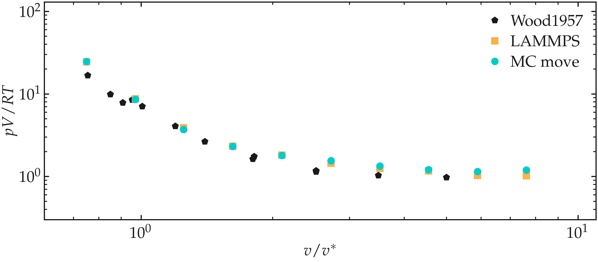
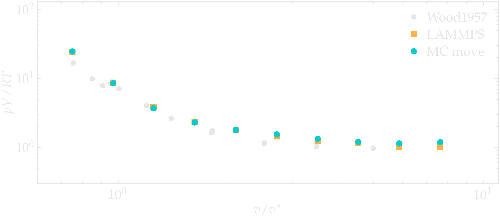

.. _project1-label:

A study of argon
================

Using Monte Carlo simulations, the equation of state of 3D fluid of argon is simulated
for a large range of density.

.. figure:: project1/avatar-dm.webp
    :alt: The fluid made of argon atoms and simulated using monte carlo and python.
    :height: 200
    :align: right
    :class: only-dark

.. figure:: project1/avatar.webp
    :alt: The fluid made of argon atoms and simulated using monte carlo and python
    :height: 200
    :align: right
    :class: only-light

In 1957, Wood and Parker reported the first numerical study of a 3D fluid that was
using an attractive Lennard-Jones potential :cite:`woodMonteCarloEquation1957` (before
them, Metropolis et al. used repultive hard-sphere
potentials only :cite:`metropolis1953equation, metropolis1953simulated`).
In their study, Wood and Parker used a Monte Carlo algorithm to predit the 
Equation of State (EoS) of neutral particles interacting with Lennard-Jones potential,
whose parameters were chosen to match those of argon gas. Their results show
good agreement with experimental measurements of Michels on argon :cite:`michels1949isotherms`.

Here, we take advantage of our code and try to reproduce the results of Wood and Parker
for varying density. To follow this project, only Monte Carlo move are needed,
and all the chapters up to :ref:`chapter7-label` must have been followed.

Parameters choice
-----------------

Some parameters are taken *exactly* the same as those from Wood and Parker:

- :math:`\sigma = 3.405~\text{Å}` (calculated as :math:`\sigma = r^*  2^{-1/6}`
  where :math:`r^*  = 3.822~\text{Å}`),
- :math:`\epsilon = 0.238~\text{kcal/mol}`,
- :math:`m = 39.948~\text{g/mol}`,
- :math:`T = 328.15~\text{K}` (or :math:`T = 55~^\circ\text{C}`).

In addition, some parameters that are not specified by Wood and Parker are
freely chosen, but it should not impact the result too much, except may be
for the cut-off:

- :math:`d_\text{mc} = \sigma/5`,
- :math:`r_\text{c} = 2.5 \sigma`.

Finally, since an average modern laptop is much faster than Wood and Parker's
IBM 701 calculators (if you are curious, here is the |IBM-wiki| page of the IBM 701),
let us choose a number of atoms that is slightly larger
than theirs, i.e. :math:`N_\text{atom} = 200`.

.. |IBM-wiki| raw:: html

    <a href="https://en.wikipedia.org/wiki/IBM_701" target="_blank">wikipedia</a>

In order to cover the same density range as Wood and Parker, let us vary the volume
of the box, :math:`V`, so that :math:`V/V^* \in [0.75, 7.6]`, where
:math:`V^* = 2^{-1/2} N_\text{A} r^{*3} = 23.77 \text{centimeter}^3/\text{mole}`
is the molar volume.

Equation of State
-----------------

The Equation of State (EoS) is a fundamental relationship in thermodynamics and
statistical mechanics that describes how the state variables of a system, such as
pressure :math:`p`, volume :math:`V`, and temperature :math:`T`, are interrelated.
Here, let us extract the pressure of the fluid for different density values.

In a Python script, let us start by import the *constants* module of *SciPy*, and
the UnitRegistry of *Pint*.

.. code-block:: python

    from scipy import constants as cst
    from pint import UnitRegistry
    ureg = UnitRegistry()
    ureg = UnitRegistry(autoconvert_offset_to_baseunit = True)

Let up also import *NumPy*, *sys*, and *multiprocessing* to launch multiple
simulations in parallel.

.. code-block:: python

    import sys
    import multiprocessing
    import numpy as np

Provide the full path to the code. If the code was written in the same folder
as the current Python script, then *path_to_code = "./"*: 

.. code-block:: python

    path_to_code = "./"
    sys.path.append(path_to_code)

Then, let us import the *MinimizeEnergy* and *MonteCarlo* classes:

.. code-block:: python

    from MinimizeEnergy import MinimizeEnergy
    from MonteCarlo import MonteCarlo

Let us take advantage of the *constants* module to define a few units, and assign
the right units to these variable using the UnitRegistry:

.. code-block:: python

    kB = cst.Boltzmann*ureg.J/ureg.kelvin # boltzman constant
    Na = cst.Avogadro/ureg.mole # avogadro
    R = kB*Na # gas constant

Then, let us write a function called *launch_MC_code* that will be used to call
our Monte Carlo script with a chosen value of :math:`\tau = v / v^*`. As a first
step, all the required variables are being defined, and the *box_size* is calculated
according to the chosen value of :math:`\tau`:

.. code-block:: python

    def launch_MC_code(tau):

        epsilon = (119.76*ureg.kelvin*kB*Na).to(ureg.kcal/ureg.mol) # kcal/mol
        r_star = 3.822*ureg.angstrom # angstrom
        sigma = r_star / 2**(1/6) # angstrom
        N_atom = 200 # no units
        m_argon = 39.948*ureg.gram/ureg.mol
        T = (55 * ureg.degC).to(ureg.degK) # 55°C
        # volume_star = (23.79 * ureg.centimeter**3/ureg.mole).to(ureg.angstrom**3/ureg.mole)
        volume_star = r_star**3 * Na * 2**(-0.5)
        cut_off = sigma*2.5
        displace_mc = sigma/5 # angstrom
        volume = N_atom*volume_star*tau/Na
        box_size = volume**(1/3)
        folder = "outputs_tau"+str(tau)+"/"

Then, let us call the *MinimizeEnergy* class, just to create and relax the
system, and avoid starting the Monte Carlo simulation with too much overlap
between the atoms:

.. code-block:: python

    def launch_MC_code(tau):
        (...)
        folder = "outputs_tau"+str(tau)+"/"

        em = MinimizeEnergy(maximum_steps=100,
                            thermo_period=10,
                            dumping_period=10,
            number_atoms=[N_atom],
            epsilon=[epsilon.magnitude], 
            sigma=[sigma.magnitude],
            atom_mass=[m_argon.magnitude],
            box_dimensions=[box_size.magnitude,
                            box_size.magnitude,
                            box_size.magnitude],
            cut_off=cut_off.magnitude,
            data_folder=folder,
        )
        em.run()

Then, let us start the Monte carlo simulation. As initial positions for the atoms,
let us use the last positions from the *em* run,
i.e. *initial_positions = em.atoms_positions*em.reference_distance*:

.. code-block:: python

    def launch_MC_code(tau):
        (...)
        em.run()

        mc = MonteCarlo(maximum_steps=20000,
            dumping_period=1000,
            thermo_period=1000,
            neighbor=50,
            displace_mc = displace_mc.magnitude,
            desired_temperature = T.magnitude,
            number_atoms=[N_atom],
            epsilon=[epsilon.magnitude], 
            sigma=[sigma.magnitude],
            atom_mass=[m_argon.magnitude],
            box_dimensions=[box_size.magnitude,
                            box_size.magnitude,
                            box_size.magnitude],
            initial_positions = em.atoms_positions*em.reference_distance,
            cut_off=cut_off.magnitude,
            data_folder=folder,
        )
        mc.run()

Finally, it is possible to call the *launch_MC_code* function using
*multiprocessing*, and perform the simulation for multiple value of :math:`\tau`
at the same time (if your computer has enough CPU core, if not, perform these calculation
in serial):

.. code-block:: python

    if __name__ == "__main__":
        tau_values = np.round(np.logspace(-0.126, 0.882, 10),2)
        pool = multiprocessing.Pool()
        squared_numbers = pool.map(launch_MC_code, tau_values)
        pool.close()
        pool.join()

Here, the 10 requested values of :math:`\tau` are 0.75, 0.97, 1.25, 1.62, 2.1,
2.72, 3.52, 4.55, 5.89, and 7.62. Run the script using Python.

When the simulation is done, extract the values of *Epot.dat* within each
folder named *outputs_tau0.75/*, where *0.75* is the corresponding value of :math:`\tau`.
Disregard the first values of Epot, and only keep the last part of the Monte Carlo simulation.
Then, plot *p V / RT* as a function of *V/V^*. The results are in good aggreement
with those of Ref. :cite:`woodMonteCarloEquation1957`:

Figure: Equation of state of the argon fluid as calculated using the Monte
carlo code (disks), and compared with the results from Ref. :cite:`woodMonteCarloEquation1957`.
Normalised pressure, :math:`p V / RT` as a function of the normalised volume,
:math:`V / V^*`, where :math:`V^*` is the molar volume. For benchmark purpose,
the data obtained using LAMMPS were also added.